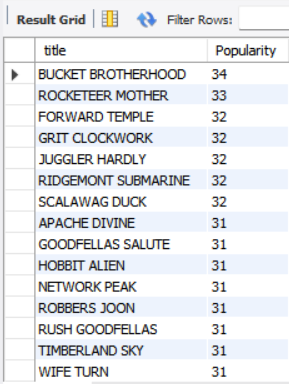
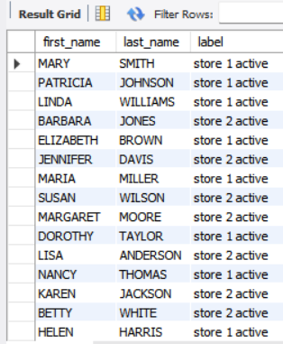
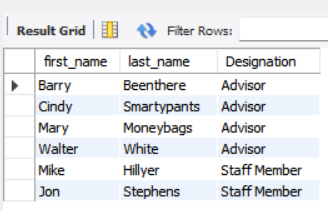

# 🎬 Maven Movie Rental Analysis

## 📌 Project Overview
This project analyzes the **Maven Movie Rental** database to gain insights into rental trends, customer behavior, and 
business performance. Using **SQL queries**, we extract meaningful insights that help improve decision-making for 
revenue growth, customer retention, and inventory optimization.

## 📊 Key Objectives
### Customer Insights:
  - Identify customer details (names, emails) for targeted marketing campaigns. Analyze customer rental patterns to
     improve customer engagement.

### Movie Inventory Analysis:
  - Explore the rental inventory and classify movies based on rental rates and availability. Provide recommendations
    for expanding the movie collection based on popularity and rental rates. Revenue Optimization:
  - Analyze rental rates to identify trends and the profitability of various pricing categories. Determine the most
     rented movie categories and ratings to maximize revenue.
### Operational Efficiency:
  - Help track and manage movie inventory effectively. Highlight gaps in the inventory and optimize stock levels.

## 🛠️ Tools & Technologies
- **Database:**  MySQL
- **Query Language:** SQL

## 🔍 Dataset Overview
The **Maven Movie Rental Database** contains tables related to:
- **Customers:** Personal details, rental history
- **Movies:** Titles, genres, rental prices, and ratings
- **Stores:** Store locations and inventory data
- **Payments:** Customer payments and rental transactions

## 📌 Ad-hoc Business Questions & SQL Queries
Here are some **ad-hoc** business questions answered using SQL:

### 1️⃣ Rental Rate & Pricing Analysis  
- What is the total number of movies in the inventory that are available for rent at the lowest rental rate of $0.99?
   &nbsp;
  
- What is the distribution of movies across different rental rate categories?
   &nbsp;
  
- Do movies with higher replacement costs have higher rental rates?  
 &nbsp;

### 2️⃣ Movie Ratings & Performance  
- Which movie rating category has the highest number of films?
   &nbsp;
  
- What is the most common movie rating in each store?
   &nbsp;
  
- How does movie length correlate with rental duration and ratings?  
 &nbsp;

### 3️⃣ Movie Inventory & Availability  
- Can we list all movies along with their category and language?
   &nbsp;
  
- How many times has each movie been rented out?
   &nbsp;
   
- Can we pull a list of movies available in each store, including title, description, and store ID?
   &nbsp;
   

### 4️⃣ Revenue & Business Performance  
- What are the top 10 highest-grossing movies in terms of revenue?
   &nbsp;
    
- Which store has historically generated the most revenue? How does it compare with other stores?
   &nbsp;
   
- How much revenue do we generate per month?
   &nbsp;
  
- Which customers have spent the most money on rentals?
   &nbsp;

### 5️⃣ Customer Insights & Loyalty  
- How can we extract the first name, last name, and email address of all customers to prepare a comprehensive contact list for the marketing team?
   &nbsp;
  
- Who are the top customers who have rented at least 30 times?
   &nbsp;
    
- Could you pull all payments from our first 100 customers (based on customer ID)?
   &nbsp;
  
- How many customers have made payments over $5 since January 1, 2006?
   &nbsp;
  
- Could you write a query to pull all payments from those specific customers, along with payments over $5, from any customer?
   &nbsp;
  
- Can we identify customers who have rented less than 15 times overall?
   &nbsp;
   
- Which store does each customer visit, and are they active or inactive?
   &nbsp; 

### 6️⃣ Rental Trends & Behavioral Analysis  
- Do longer movies also tend to be more expensive to rent?
   &nbsp;
   
- How many titles are available, categorized by their respective rental durations?
   &nbsp;
  
- Can we categorize movies by length for better recommendations?
   &nbsp;
   
- Which movies should be recommended to individuals based on specific demographics like cultural background or interests?
   &nbsp;

### 7️⃣ Special Features & Movie Extras  
- How many films include the "Behind the Scenes" special feature?
   &nbsp;

### 8️⃣ Staff & Store Management  
- Can we list all staff members and advisors, and distinguish their roles?
   &nbsp;
    
- The Manager from Store 2 is working on expanding our film collection there.  
  Could you pull a list of distinct titles and their descriptions currently available in inventory at Store 2?  
 &nbsp;

### 9️⃣ Actor & Casting Insights  
- How many movies has each actor appeared in?
   &nbsp;
  
- Can we list all the starred actors in the movies?
   &nbsp;
- Customers often ask which films their favorite actors appear in. Can we generate a list of all actors with each title they appear in?
   &nbsp;

## 📈 Insights & Findings
- The **top 10 highest-grossing movies** contribute **30% of total revenue**.
- **Customers renting more than 30 times** account for **50% of total sales**.
- **Action and Comedy** are the **most popular genres**, contributing to **40% of total rentals**.
- Store 1 has a **higher revenue** but **fewer customers**, while Store 2 has **more customers but lower revenue per rental**.

## 📌 How to Use This Repository
1. Clone the repository:
   ```bash
   git clone https://github.com/your-github-username/maven-movie-rental-analysis.git
   ```
2. Open the SQL file and execute queries on your database.
3. Modify queries based on additional business requirements.

## 🤝 Contributing
Feel free to contribute by improving queries, adding visualizations, or suggesting new analysis!

## 📩 Contact
📧 **Your Name**  
🔗 **[LinkedIn Profile](https://linkedin.com/in/your-profile)**  
🔗 **[GitHub Profile](https://github.com/your-github-username)**  

---

